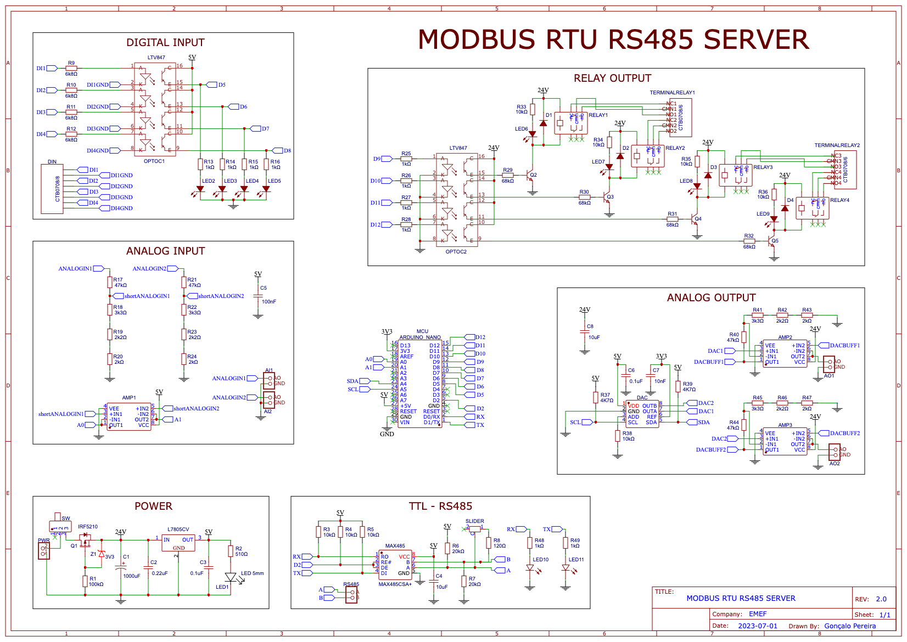
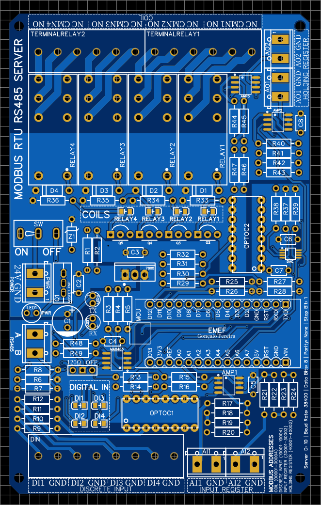

# Improved schematic and PCB layout
Second version of the project, done after the official conclusion of the report.

MAIN CHANGES:
Changed MCU to Arduino Nano, which is smaller; added power reverse polarity protection; added DAC of 10 bits that will communicate through I2C with the Arduino Nano; added copper area to the PCB, something that wasn't done on the previous iteration of the project; added bypass capacitors close to the amplifiers and another components that may require stable voltage; new PCB design with improved location of the components; smaller size of the PCB; added LED signals to verify digital pins states; changed the module of the MAX485 to an actual implementation.

