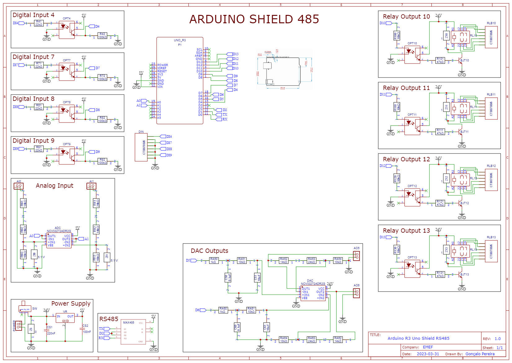

# Projeto Integrador - EMEF
Developed code for an Arduino (MCU) to establish communication between a computer.
The MCU will be set as a Modbus RTU Server, through RS485 communication cable.
Library adapted from https://github.com/CMB27/ModbusRTUSlave.

# Project V1
First iteration of the project, presented in the final report.

# Project V2
Improved project with an Arduino Nano and several other improvements.

![SchematicV2](ProjectV2/SchematicV2.png
